# Module 0: Welcome

# Lab 00: Validate lab environment

## Evidences:

 In Azure portal go to **Azure DevOps organizations**:

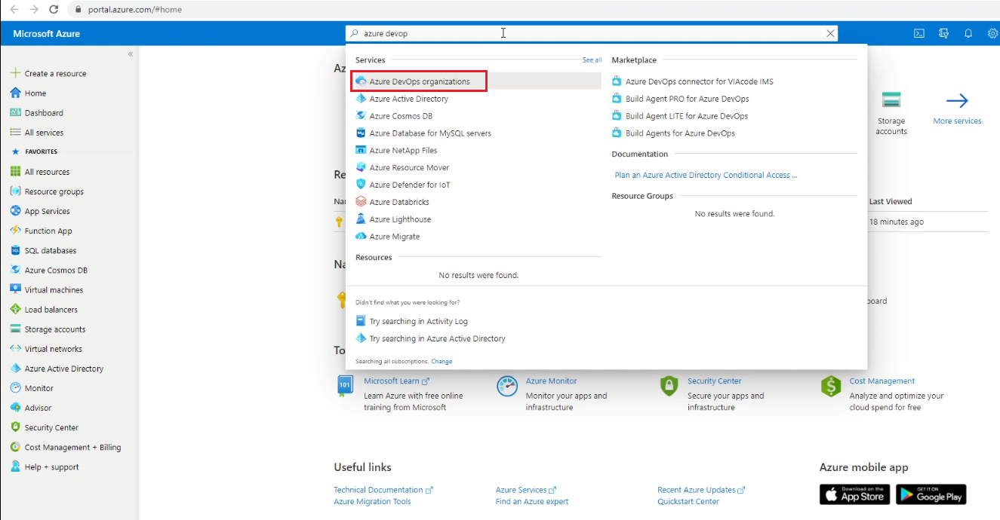

 Click on the link labelled **My Azure DevOps Organizations**:

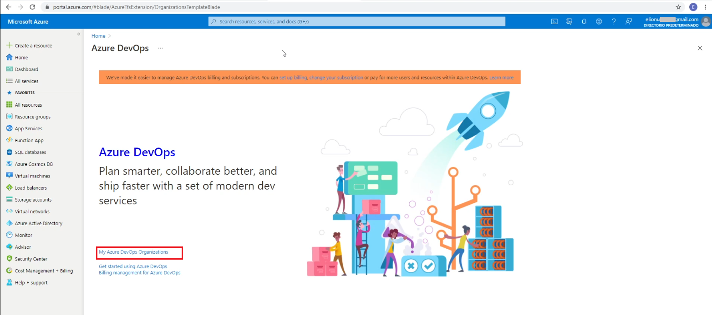

Choose **Default Directory**, instead of “Microsoft Account”:

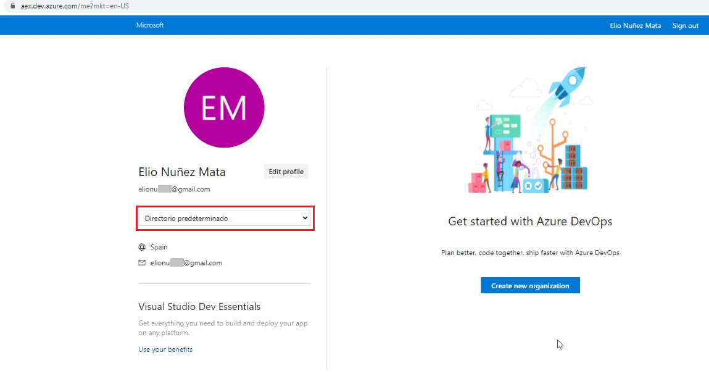

Prompted for *“more details”*:

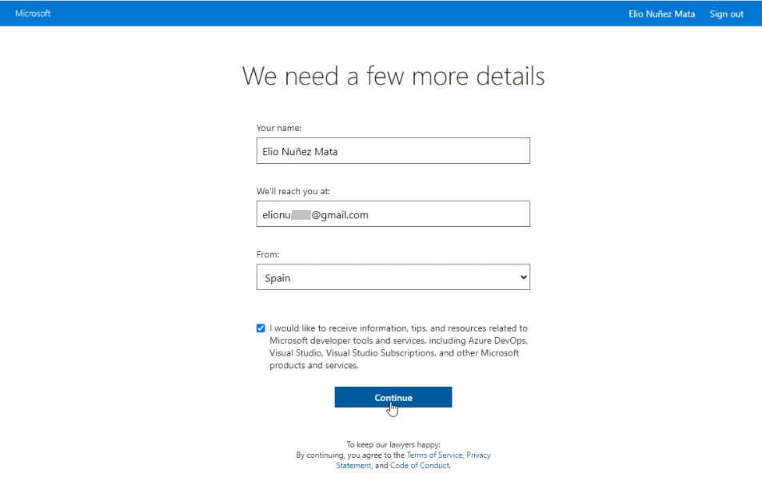

Click the button **Create new organization** and Accept the *Terms of Service*:

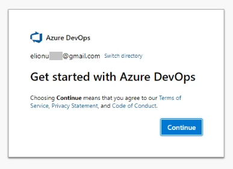

Continue to create the new organization:

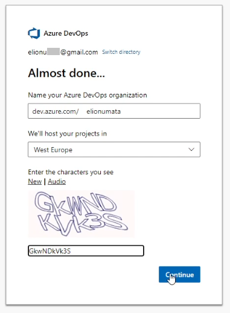

The newly created organization opens in **Azure DevOps** and then click **Organization settings**:

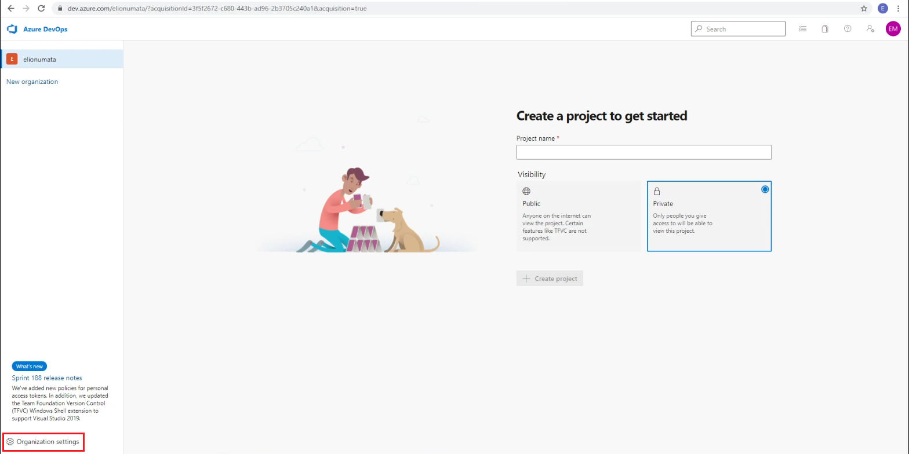

At the **Organization settings** screen click **Billing** :

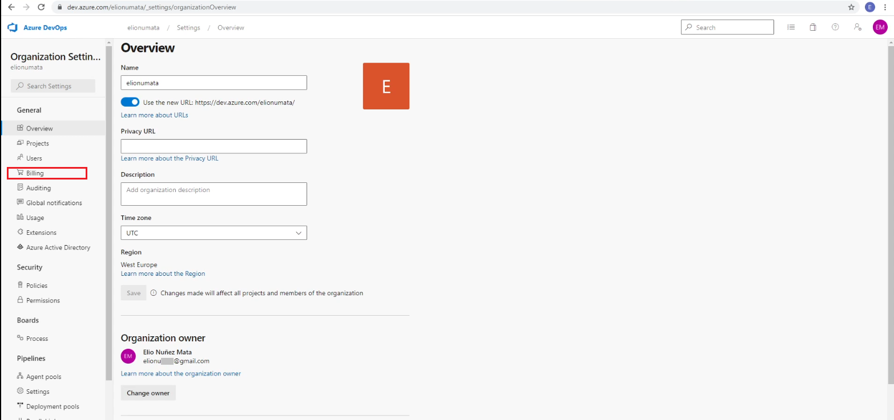

Click **Setup billing**:

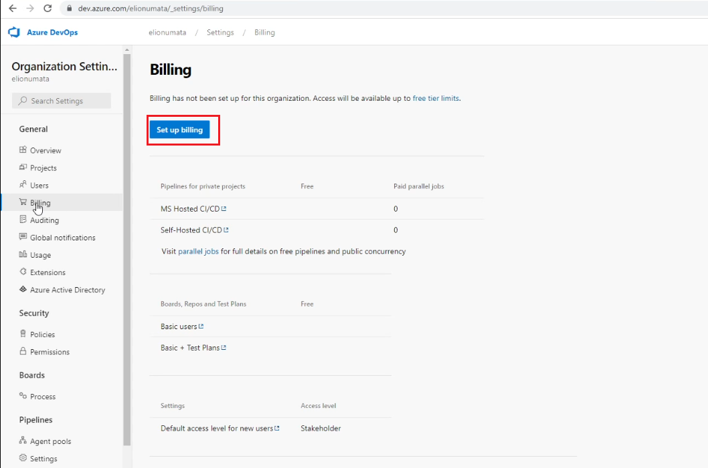

Select the active **Azure Pass - Sponsorship** subscription and save it:

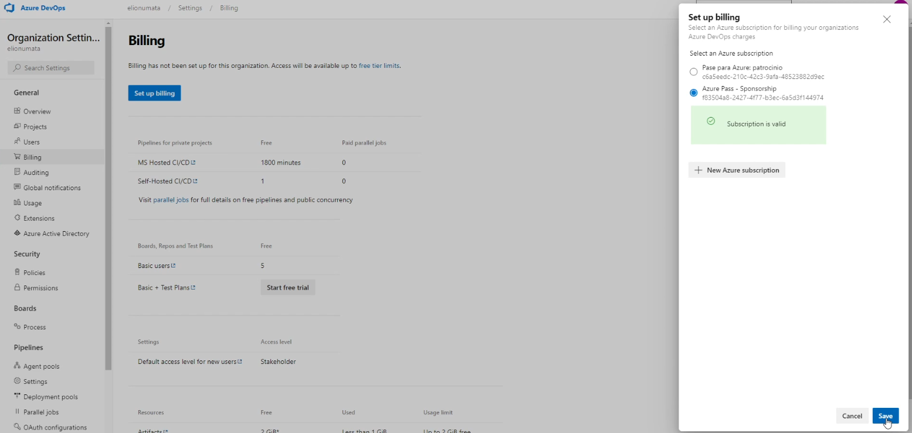

Change the number of **Paid parallel jobs** for **MS Hosted** to 1 and save it:

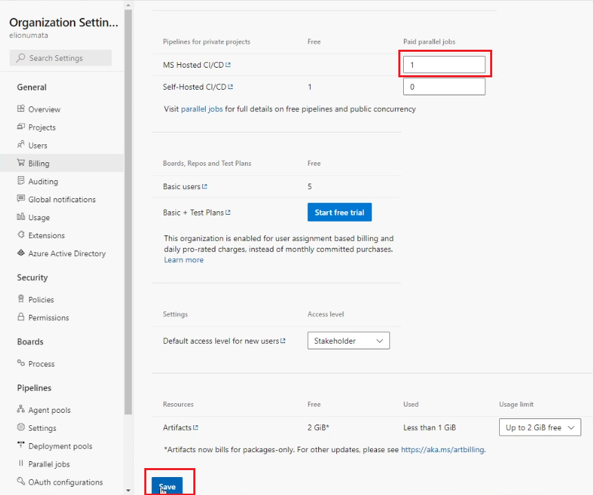

The environment is ready!

